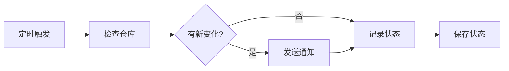

# Git Repository Monitor 📡

自动监控指定 Git 仓库的变化（commits, tags, releases），并通过 Telegram 和微信（WxPusher）发送通知。

## 功能特性

- ✅ 监控新的 commits
- ✅ 监控新的 tags
- ✅ 监控新的 releases
- ✅ Telegram Bot 通知
- ✅ 微信通知（通过 WxPusher）
- ✅ 自动定时检查
- ✅ 状态持久化，避免重复通知

## 快速开始

### 1. Fork 或克隆此仓库

```bash
git clone <your-repo-url>
cd <your-repo-name>
```

### 2. 配置 GitHub Secrets

在仓库的 **Settings → Secrets and variables → Actions** 中添加以下 secrets：

#### 必需配置

| Secret 名称 | 说明 | 示例 |
|------------|------|------|
| `MONITORED_REPOS` | 要监控的仓库列表（多个仓库用逗号分隔） | `torvalds/linux,microsoft/vscode` |
| `MONITORED_REPO` | 单个仓库监控（向后兼容，建议使用上面的） | `torvalds/linux` |

**说明：**
- 优先使用 `MONITORED_REPOS` 支持多仓库监控
- 多个仓库用英文逗号分隔，如：`owner1/repo1,owner2/repo2,owner3/repo3`
- 如果只监控一个仓库，两个配置都可以使用

#### Telegram 配置（可选）

| Secret 名称 | 说明 | 获取方式 |
|------------|------|---------|
| `TELEGRAM_BOT_TOKEN` | Telegram Bot Token | 与 @BotFather 对话创建 bot |
| `TELEGRAM_CHAT_ID` | Telegram Chat ID | 发送消息给 @userinfobot 获取 |

**获取 Telegram 配置步骤：**

1. 在 Telegram 中搜索 `@BotFather`
2. 发送 `/newbot` 创建新 bot
3. 按提示设置 bot 名称和用户名
4. 获得 Bot Token（格式：`1234567890:ABCdefGhIJKlmNoPQRsTUVwxyZ`）
5. 搜索 `@userinfobot`，发送任意消息获取你的 Chat ID

#### 微信配置（可选，选择其中一个或多个）

**方案1：WxPusher**

| Secret 名称 | 说明 | 获取方式 |
|------------|------|---------|
| `WXPUSHER_APP_TOKEN` | WxPusher 应用Token | [WxPusher官网](http://wxpusher.zjiecode.com) 注册并创建应用 |
| `WXPUSHER_UID` | WxPusher 用户UID | 关注 WxPusher 公众号后在"我的"-"我的UID"中查看 |

**获取 WxPusher 配置步骤：**

1. 访问 [WxPusher 官网](http://wxpusher.zjiecode.com/admin/)
2. 注册账号并登录
3. 创建应用，获取 `APP_TOKEN`
4. 微信扫码关注 WxPusher 公众号
5. 在公众号中点击"我的" → "我的UID"获取 `UID`

**方案2：PushPlus（推荐，更简单）**

| Secret 名称 | 说明 | 获取方式 |
|------------|------|---------|
| `PUSHPLUS_TOKEN` | PushPlus Token | [PushPlus官网](http://www.pushplus.plus) 注册并获取Token |

**获取 PushPlus 配置步骤：**

1. 访问 [PushPlus 官网](http://www.pushplus.plus)
2. 使用微信扫码登录
3. 在"发送消息"页面找到你的 `Token`
4. 复制 Token 即可使用

#### 可选配置

| Secret 名称 | 说明 | 默认值 |
|------------|------|--------|
| `CRON_SCHEDULE` | 定时任务 Cron 表达式 | `0 * * * *`（每小时） |

**Cron 表达式示例：**
- `*/30 * * * *` - 每 30 分钟
- `0 */2 * * *` - 每 2 小时
- `0 */6 * * *` - 每 6 小时
- `0 0 * * *` - 每天凌晨

### 3. 启用 GitHub Actions

1. 进入仓库的 **Actions** 标签
2. 点击 "I understand my workflows, go ahead and enable them"
3. 找到 "Git Repository Monitor" workflow
4. 点击 "Enable workflow"

### 4. 手动触发测试

1. 在 Actions 页面，点击左侧的 "Git Repository Monitor"
2. 点击右上角的 "Run workflow"
3. 点击绿色的 "Run workflow" 按钮
4. 等待运行完成，检查是否收到通知

## 工作流程



1. **定时检查**：按照配置的 Cron 表达式定时运行
2. **获取最新状态**：通过 GitHub API 获取最新的 commit、tag、release
3. **对比状态**：与上次保存的状态对比，检测变化
4. **发送通知**：如有新变化，发送到配置的通知渠道
5. **保存状态**：更新状态文件，避免重复通知

## 本地测试

### 前置要求

- Python 3.8+
- pip

### 安装依赖

```bash
pip install -r requirements.txt
```

### 设置环境变量

```bash
# 必需
export MONITORED_REPO="owner/repo"

# 可选：Telegram
export TELEGRAM_BOT_TOKEN="your_bot_token"
export TELEGRAM_CHAT_ID="your_chat_id"

# 可选：微信
export WXPUSHER_APP_TOKEN="your_app_token"
export WXPUSHER_UID="your_uid"

# 可选：GitHub PAT（提高 API 限制或访问私有仓库）
export GITHUB_TOKEN="your_github_pat"
```

### 运行脚本

```bash
python scripts/monitor.py
```

## 文件结构

```
.
├── .github/
│   └── workflows/
│       └── git-monitor.yml    # GitHub Actions 工作流配置
├── scripts/
│   └── monitor.py             # 核心监控脚本
├── .gitignore                 # Git 忽略文件
├── .monitor_state.json        # 状态文件（自动生成）
├── requirements.txt           # Python 依赖
└── README.md                  # 使用文档
```

## 通知格式

### Commit 通知
```
📝 owner/repo 新提交

Commit: abc1234
作者: John Doe
消息: Fix bug in login function
时间: 2024-01-01T12:00:00Z

🔗 查看详情
```

### Tag 通知
```
🏷️ owner/repo 新标签

标签: v1.2.0
Commit: def5678

🔗 查看详情
```

### Release 通知
```
🚀 owner/repo 新版本发布

版本: Version 1.2.0
标签: v1.2.0
发布时间: 2024-01-01T12:00:00Z

说明:
- Added new feature X
- Fixed bug Y
...

🔗 查看详情
```

## 常见问题

### Q: 为什么没有收到通知？

**A:** 请检查：
1. Secrets 是否正确配置
2. GitHub Actions 是否启用
3. 查看 Actions 运行日志，确认是否有错误
4. 确认监控的仓库是否有新变化
5. 首次运行不会发送通知（只记录初始状态）

### Q: 如何修改检查频率？

**A:** 有两种方式：
1. 在 GitHub Secrets 中设置 `CRON_SCHEDULE`
2. 直接修改 `.github/workflows/git-monitor.yml` 中的 `cron` 值

### Q: API 限流怎么办？

**A:** 
- 自动提供的 token：每小时 1000 次（足够使用）
- Personal Access Token：每小时 5000 次

**如需更高限制，可配置 `GH_PAT`：**
1. GitHub 头像 → Settings → Developer settings
2. Personal access tokens → Tokens (classic) → Generate new token
3. 权限：`public_repo`（私有仓库需要 `repo`）
4. 在仓库 Secrets 中添加名为 `GH_PAT` 的 secret（不能使用 `GITHUB_` 前缀）

### Q: 能监控私有仓库吗？

**A:** 可以。需要：
1. 创建具有 `repo` 权限的 GitHub Personal Access Token
2. 在 Secrets 中添加 `GH_PAT`（注意：不能使用 `GITHUB_` 前缀）

### Q: 如何监控多个仓库？

**A:** 目前版本每个工作流实例只能监控一个仓库。如需监控多个仓库，可以：
1. Fork 多个副本分别配置
2. 修改脚本支持多仓库（需要自定义开发）

### Q: 状态文件是什么？

**A:** `.monitor_state.json` 保存上次检查的状态（最新的 commit、tag、release）。工作流会自动提交这个文件，以便下次运行时对比变化。

## 进阶配置

### 自定义通知格式

编辑 `scripts/monitor.py` 中的格式化函数：
- `format_commit_message()`
- `format_tag_message()`
- `format_release_message()`

### 添加其他通知渠道

在 `scripts/monitor.py` 中继承 `NotificationService` 类实现新的通知器：

```python
class MyNotifier(NotificationService):
    def send(self, title: str, content: str, url: Optional[str] = None) -> bool:
        # 实现你的通知逻辑
        pass
```

### 监控特定分支

修改 `GitHubMonitor.get_latest_commit()` 方法，在 API 请求中添加 `sha` 参数：

```python
params = {"per_page": 1, "sha": "your-branch-name"}
```

## 许可证

MIT License

## 贡献

欢迎提交 Issue 和 Pull Request！

## 相关链接

- [GitHub Actions 文档](https://docs.github.com/en/actions)
- [GitHub API 文档](https://docs.github.com/en/rest)
- [Telegram Bot API](https://core.telegram.org/bots/api)
- [WxPusher 文档](http://wxpusher.zjiecode.com/docs)

---

**Star ⭐ 如果觉得有用！**
